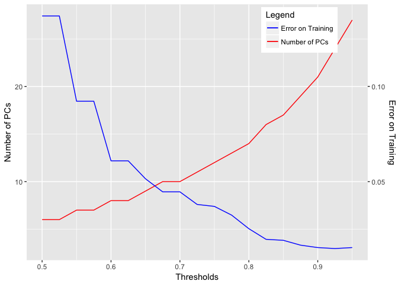

Human Activity Recognition
--------------------------

We are using exercise tech data to try to classify different types of
activities. In this dataset, six participants were asked to perform
barbell lifts correctly and incorrectly in 5 different ways. We are
tasked with cleaning and preprocessing this data in order to fit a
machine learning model to predict which of the 5 different ways
participants are performing the activity.

### Reading in the Data

    training = read.csv("~/Downloads/pml-training.csv")
    testing = read.csv("~/Downloads/pml-testing.csv")
    str(training, list.len=20)

    ## 'data.frame':    19622 obs. of  160 variables:
    ##  $ X                       : int  1 2 3 4 5 6 7 8 9 10 ...
    ##  $ user_name               : Factor w/ 6 levels "adelmo","carlitos",..: 2 2 2 2 2 2 2 2 2 2 ...
    ##  $ raw_timestamp_part_1    : int  1323084231 1323084231 1323084231 1323084232 1323084232 1323084232 1323084232 1323084232 1323084232 1323084232 ...
    ##  $ raw_timestamp_part_2    : int  788290 808298 820366 120339 196328 304277 368296 440390 484323 484434 ...
    ##  $ cvtd_timestamp          : Factor w/ 20 levels "02/12/2011 13:32",..: 9 9 9 9 9 9 9 9 9 9 ...
    ##  $ new_window              : Factor w/ 2 levels "no","yes": 1 1 1 1 1 1 1 1 1 1 ...
    ##  $ num_window              : int  11 11 11 12 12 12 12 12 12 12 ...
    ##  $ roll_belt               : num  1.41 1.41 1.42 1.48 1.48 1.45 1.42 1.42 1.43 1.45 ...
    ##  $ pitch_belt              : num  8.07 8.07 8.07 8.05 8.07 8.06 8.09 8.13 8.16 8.17 ...
    ##  $ yaw_belt                : num  -94.4 -94.4 -94.4 -94.4 -94.4 -94.4 -94.4 -94.4 -94.4 -94.4 ...
    ##  $ total_accel_belt        : int  3 3 3 3 3 3 3 3 3 3 ...
    ##  $ kurtosis_roll_belt      : Factor w/ 397 levels "","-0.016850",..: 1 1 1 1 1 1 1 1 1 1 ...
    ##  $ kurtosis_picth_belt     : Factor w/ 317 levels "","-0.021887",..: 1 1 1 1 1 1 1 1 1 1 ...
    ##  $ kurtosis_yaw_belt       : Factor w/ 2 levels "","#DIV/0!": 1 1 1 1 1 1 1 1 1 1 ...
    ##  $ skewness_roll_belt      : Factor w/ 395 levels "","-0.003095",..: 1 1 1 1 1 1 1 1 1 1 ...
    ##  $ skewness_roll_belt.1    : Factor w/ 338 levels "","-0.005928",..: 1 1 1 1 1 1 1 1 1 1 ...
    ##  $ skewness_yaw_belt       : Factor w/ 2 levels "","#DIV/0!": 1 1 1 1 1 1 1 1 1 1 ...
    ##  $ max_roll_belt           : num  NA NA NA NA NA NA NA NA NA NA ...
    ##  $ max_picth_belt          : int  NA NA NA NA NA NA NA NA NA NA ...
    ##  $ max_yaw_belt            : Factor w/ 68 levels "","-0.1","-0.2",..: 1 1 1 1 1 1 1 1 1 1 ...
    ##   [list output truncated]

### Data Cleaning

Here we output the structure of the first 20 columns of the training
set. We use this command, along with summary and some histograms to see
that many of the columns consist of values that are either mostly NA or
'' (empty strings). To clean the training set we remove these columns,
along with removing the corresponding columns from the test set.

We also see that the first column is simply an index, so we don't need
that. Furthermore, the 6th column, 'new\_window', seems to not be useful
for this classification problem.

    f1 <-  function(name) if((sum(is.na(training[name]))<19000)) {print(name)}
    notNAnames <- unlist(lapply(names(training), f1))
    training <- training[,notNAnames]
    notNAnames.test <- notNAnames[-93]
    testing <- testing[,notNAnames.test]

    f2 <-  function(name) if((sum(training[name]=='')<19000)) {print(name)}
    notEmptynames <- unlist(lapply(names(training), f2))
    training <- training[,notEmptynames]
    notEmptynames.test <- notEmptynames[-60]
    testing <- testing[,notEmptynames.test]

    training <- training[,-c(1,6)]
    testing <- testing[,-c(1,6)]

    dim(training)

    ## [1] 19622    58

### Preprocessing (PCA)

Here we see that the cleaning process has reduced the number of columns
from 160 to only 58, which is still large. We can further reduce the
number of features to use by performing a Principle Components Analysis.
After some exploratory testing, we found that using the principle
components that account for 80% of the variance is sufficient for this
problem.

    suppressMessages(library(caret))
    train_num <- data.frame(sapply(training, function(x) as.numeric(x)))
    train_num$classe <- as.factor(train_num$classe)
    preObj <- preProcess(train_num[,-58], method = "pca", thresh=0.8)
    pca_training_preds <- predict(preObj, train_num[,-58])
    dim(training)

    ## [1] 19622    58

    dim(pca_training_preds)

    ## [1] 19622    13

Here we see that only 13 principle components out of 57 (excluding the
variable we are trying to predict) are necessary to account for 80% of
the variance.

### Model Selection

We tried a number of different classification algorithms, including
Naive Bayes and Support Vector Machines, but found that a Random Forest
does the best job (Also, using train(...,method='rf') took significantly
longer than randomForest(...), so that's the method we use). Below we
show 3 crossfolds from random forest models using the top 11 principle
components. And since we aren't using train(), we can't use it's
built-in cross-validations routines.

### Cross Validation

    suppressMessages(library(caret))
    suppressMessages(library(randomForest))

    set.seed(39592)
    fold1 <- createDataPartition(training$classe, p=0.8, list = F)
    trainfold1 <- train_num[fold1,]
    testfold1 <- train_num[-fold1,]
    preObj1 <- preProcess(trainfold1[,-58], method = "pca", thresh=0.8)
    pca_training_preds1 <- predict(preObj1, trainfold1[,-58])
    pca_training_preds1$y <- trainfold1$classe
    pca_testing_preds1 <- predict(preObj1, testfold1[,-58])
    mod_rf_fold1 <- randomForest(y~.,data = pca_training_preds1)
    pred_fold1 <- predict(mod_rf_fold1, pca_testing_preds1)
    print(confusionMatrix(pred_fold1, testfold1$classe)$overall[1])

    ##  Accuracy 
    ## 0.9722151

    set.seed(40639)
    fold2 <- createDataPartition(training$classe, p=0.8, list = F)
    trainfold2 <- train_num[fold2,]
    testfold2 <- train_num[-fold2,]
    preObj2 <- preProcess(trainfold2[,-58], method = "pca", thresh=0.8)
    pca_training_preds2 <- predict(preObj2, trainfold2[,-58])
    pca_training_preds2$y <- trainfold2$classe
    pca_testing_preds2 <- predict(preObj2, testfold2[,-58])
    mod_rf_fold2 <- randomForest(y~.,data = pca_training_preds2)
    pred_fold2 <- predict(mod_rf_fold2, pca_testing_preds2)
    print(confusionMatrix(pred_fold2, testfold2$classe)$overall[1])

    ##  Accuracy 
    ## 0.9696661

    set.seed(94823)
    fold3 <- createDataPartition(training$classe, p=0.8, list = F)
    trainfold3 <- train_num[fold3,]
    testfold3 <- train_num[-fold3,]
    preObj3 <- preProcess(trainfold3[,-58], method = "pca", thresh=0.8)
    pca_training_preds3 <- predict(preObj3, trainfold3[,-58])
    pca_training_preds3$y <- trainfold3$classe
    pca_testing_preds3 <- predict(preObj3, testfold3[,-58])
    mod_rf_fold3 <- randomForest(y~.,data = pca_training_preds3)
    pred_fold3 <- predict(mod_rf_fold3, pca_testing_preds3)
    print(confusionMatrix(pred_fold3, testfold3$classe)$overall[1])

    ##  Accuracy 
    ## 0.9709406

### Dependence on PCA Threshold

Here we plot the change in the number of PCs used and the error
(1-accuracy) in a test set as we change the variation threshold for PCs.
As the threshold increases, the necessary number of PC increases, but
the error decreases.

### Test Set Predictions

    test_num <- data.frame(sapply(testing, function(x) as.numeric(x)))
    pca_testing_preds <- predict(preObj, test_num)

    pca_training_preds$y <- training$classe
    mod_rf_full <- randomForest(y~.,data = pca_training_preds)
    pred <- predict(mod_rf_full, pca_testing_preds)
    pred

    ##  1  2  3  4  5  6  7  8  9 10 11 12 13 14 15 16 17 18 19 20 
    ##  A  A  A  A  A  E  D  B  A  A  B  C  B  A  E  E  A  B  B  B 
    ## Levels: A B C D E

Since the model does well consistently on the cross-validation folds,
and because we used PCA, I think the model will do quite well on unseen
data, probably &gt;90% (out of sample error &lt;10%).
